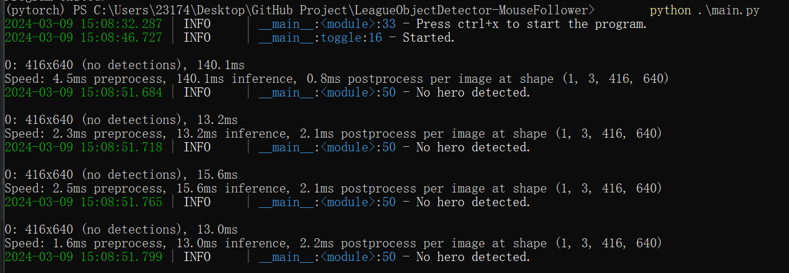

# LeagueObjectDetector-MouseFollower

本项目基于`yolo v8`以及`win32`实现对英雄联盟对局敌方角色的识别已经指针跟随。

<!-- PROJECT SHIELDS -->

[![Contributors][contributors-shield]][contributors-url]
[![Forks][forks-shield]][forks-url]
[![Stargazers][stars-shield]][stars-url]
[![Issues][issues-shield]][issues-url]
[![MIT License][license-shield]][license-url]
[![LinkedIn][linkedin-shield]][linkedin-url]

## 目录

- [上手指南](#上手指南)
  - [开发前的配置要求](#开发前的配置要求)
  - [安装步骤](#安装步骤)
- [文件目录说明](#文件目录说明)

- [部署](#部署)
- [使用到的框架](#使用到的框架)
- [贡献](#贡献)


- [作者](#作者)


### 上手指南

###### 开发前的配置要求

1. python >=3.8
2. cuda >= 11.9+

###### **安装步骤**

1. Clone the repo

```sh
git clone https://github.com/linkedlist771/LeagueObjectDetector-MouseFollower.git
```

2. Install requirements

```bash
conda create -m lol_tools python=3.10
conda activate lol_tools
pip install -r requirements.txt
```


### 文件目录说明


```
├── LICENSE
├── README.md
├── format.sh
├── lol_tools
│   ├── __init__.py
│   ├── __pycache__
│   │   ├── __init__.cpython-39.pyc
│   │   ├── key_types.cpython-39.pyc
│   │   ├── schemas.cpython-39.pyc
│   │   └── yolo_detect.cpython-39.pyc
│   ├── configs
│   │   ├── __init__.py
│   │   ├── __pycache__
│   │   │   ├── __init__.cpython-39.pyc
│   │   │   └── yolo_configs.cpython-39.pyc
│   │   └── yolo_configs.py
│   ├── cv2_detect.py
│   ├── hero_manager.py
│   ├── key_types.py
│   ├── models
│   │   └── best.pt
│   ├── schemas.py
│   ├── utils
│   │   ├── __init__.py
│   │   ├── __pycache__
│   │   │   ├── __init__.cpython-39.pyc
│   │   │   ├── input_utils.cpython-39.pyc
│   │   │   └── screen_utils.cpython-39.pyc
│   │   ├── input_utils.py
│   │   └── screen_utils.py
│   └── yolo_detect.py
├── main.py
└── take_scrrenshot.py

```


### 部署

Start the script(**在运行的时候，请确保您处于管理员权限**):
```bash
python main.py
```

> 默认情况下，触发按钮被设置为`ctrl+x`，按下后会开始检测敌方英雄的位置并且将鼠标指针移动到敌方英雄的位置。
> 你也可以通过添加参数`--invoke_key`来修改触发按钮的设置。

### 使用到的框架

- [Pytorch](https://pytorch.org)
- [OpenCV](https://opencv.org)
- ...

### 贡献

这个项目还是处于一个非常原始的阶段，所以还有很多需要改进的地方。如果你有任何建议或者想要参与到这个项目中来，欢迎提交PR或者issue。
修改完代码后请运行`format.sh`来格式化代码。


### 作者

213193509seu@gmail.com


### 版权说明

该项目签署了MIT 授权许可，详情请参阅 [LICENSE](LICENSE)
